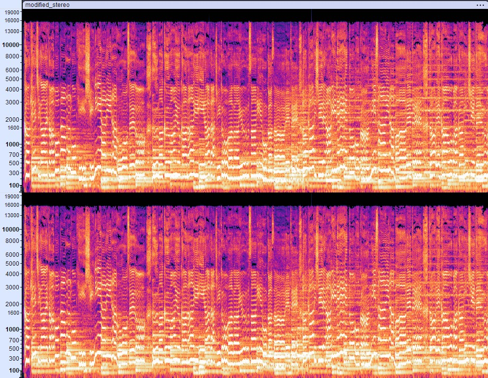

# Spectral Image Steganography

A Python tool that hides images within audio spectrograms using stereo phase encoding. 

[NEW Update!](#update)   

[](## "Stereo spectrogram shows normal audio patterns") 
[](## "When collapsed to mono, the hidden image appears")  

## Overview

This tool embeds images into audio files in a way that they remain invisible in the stereo spectrogram, but become clearly visible when the audio is converted to mono. It works by manipulating the phase relationship between the left and right stereo channels.

## How It Works

1. The script loads a stereo audio file and a grayscale image
2. It embeds the image in a specific time and frequency range within the audio
3. Left and right channels are encoded with specific phase relationships:
   - When the image is dark, the channels are nearly in-phase
   - When the image is bright, the channels are nearly out-of-phase
4. In the stereo view, the image is not visible
5. When channels are collapsed to mono, the phase differences create amplitude variations that match the image

## Features

- Embed grayscale images into stereo audio files
- Automatic duration calculation to preserve aspect ratio
- Frequency range customization
- Logarithmic frequency scale compensation
- Adjustable image intensity
- Comprehensive spectrogram visualization

## Installation

```bash
pip install numpy matplotlib pillow librosa soundfile scipy
```

## Usage

### Basic Example

```bash
python monomark.py -a input_audio.wav -i input_image.png -o output
```

### Advanced Options

```bash
python monomark.py \
  --audio-path input_audio.wav \
  --image-path input_image.png \
  --output-folder output \
  --start-time 10.0 \
  --min-freq 4000 \
  --max-freq 16000 \
  --intensity 1.0 \
  --auto-duration \
  --comp-log \
  --preserve
```

## Key Parameters

- `--audio-path`: Input audio file (WAV format recommended)
- `--image-path`: Input image file (grayscale PNG/JPG recommended)
- `--start-time`: When to begin embedding the image (seconds)
- `--duration`: Duration of the embedding (seconds) - ignored with auto-duration
- `--min-freq`, `--max-freq`: Frequency range for embedding (Hz)
- `--intensity`: Strength of the effect (0.0-1.0)
- `--auto-duration`: Calculate duration automatically based on image aspect ratio
- `--comp-log`: Compensate for logarithmic frequency scale distortion
- `--preserve`: Maintain original image aspect ratio

## Visualization Options

- `--preview`: Display spectrograms after processing
- `--save-spec`: Save spectrogram images
- `--zoom`: Automatically zoom display to embedded image area
- `--spec-min-freq`, `--spec-max-freq`: Customize frequency range for display
- `--spec-start`, `--spec-end`: Customize time range for display

## Output Files

The tool produces:
- Modified stereo audio file
- Modified mono audio file (for verification)
- Spectrogram visualizations

## Applications

- Audio watermarking
- Artistic audio-visual creations
- Data hiding for creative projects
- Audio easter eggs

## Update

Added a visible stereo mode that lets you make watermarks directly visible in the spectrogram without needing to collapse to mono first. The standard mode still hides images until channels are combined, but with the new `-V` flag, images show up clearly in both stereo and mono. You probably need to crank up intensity in some cases. Great for art projects or when you actually want people to see your watermark. Just add `-V` to your command:   

```python monomark.py -a input.wav -i logo.png -V```
